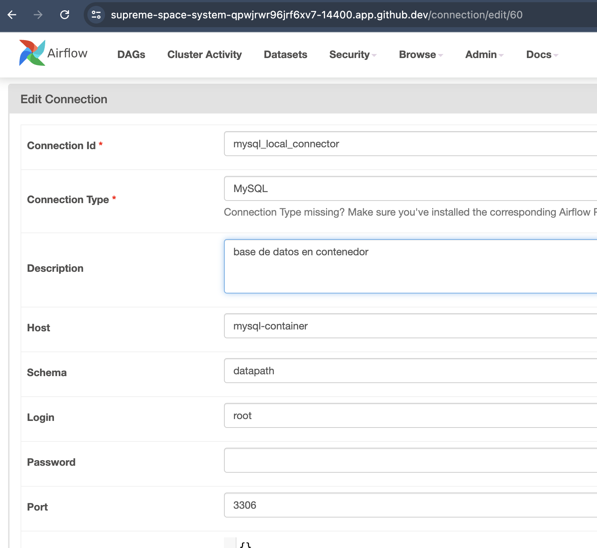
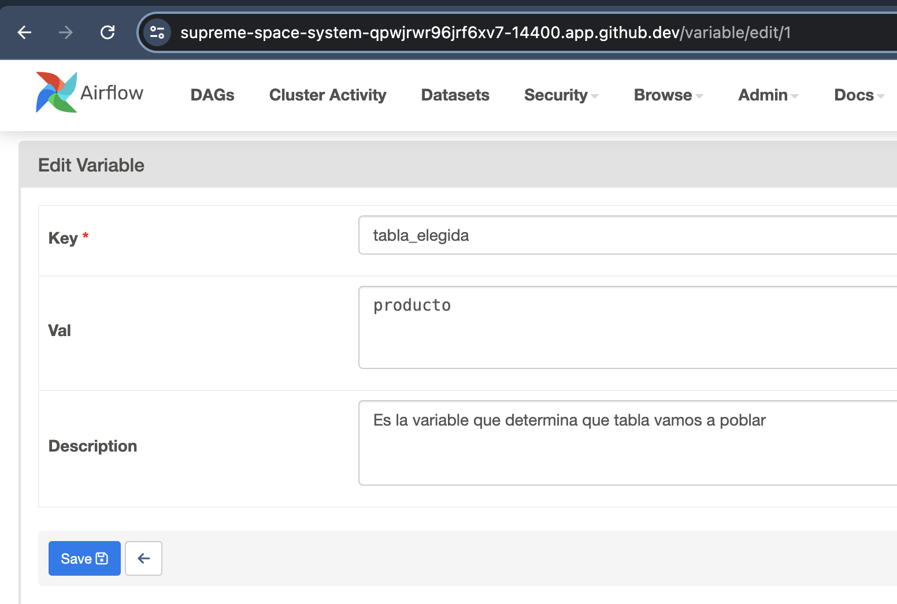
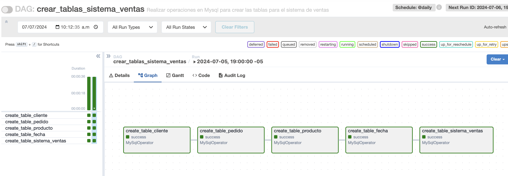
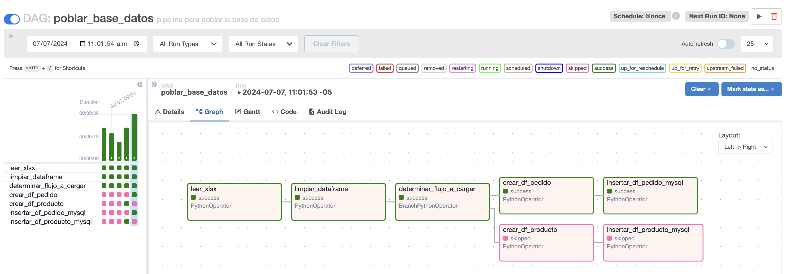
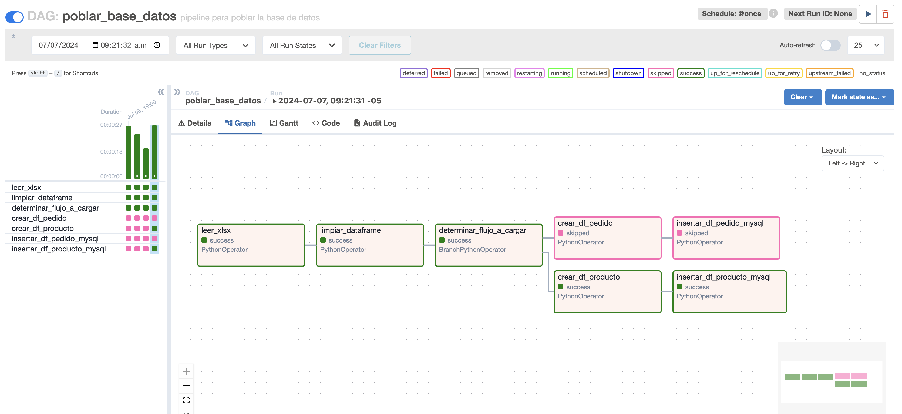
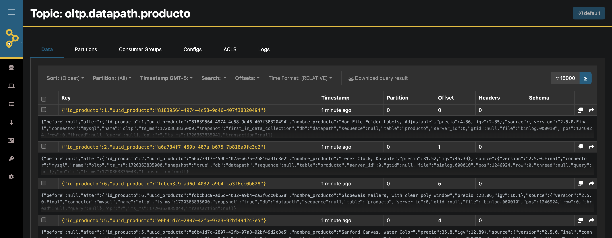

#### Real time processing

##### Requisitos Previos:

1) Crear imagen customizada de Apache Spark

```
@bryanalonso1993 ➜ /workspaces/real_time_processing (main) $ ls
Readme.md  docker-compose.yaml  dumps  register-mysql.json  spark_custom_image
@bryanalonso1993 ➜ /workspaces/real_time_processing (main) $ cd spark_custom_image/
@bryanalonso1993 ➜ /workspaces/real_time_processing/spark_custom_image (main) $ ls
Dockerfile  start-spark.sh
@bryanalonso1993 ➜ /workspaces/real_time_processing/spark_custom_image (main) $ docker build -t apache-spark:v1 .
[+] Building 162.3s (13/13) FINISHED                                                                                                                                     docker:default
 => [internal] load build definition from Dockerfile                                                                                                                               0.2s
 => => transferring dockerfile: 1.44kB                                                                                                                                             0.0s
 => [internal] load metadata for docker.io/library/openjdk:11.0.11-jre-slim-buster                                                                                                 0.7s
 => [auth] library/openjdk:pull token for registry-1.docker.io                                                                                                                     0.0s
```
2) Crear la imagen de apache airflow

```
@bryanalonso1993 ➜ /workspaces/real_time_processing (main) $ cd spark_custom_image/
@bryanalonso1993 ➜ /workspaces/real_time_processing/spark_custom_image (main) $ ls
Dockerfile  start-spark.sh
@bryanalonso1993 ➜ /workspaces/real_time_processing/spark_custom_image (main) $ docker build -t apache-spark:v1 .
[+] Building 0.7s (12/12) FINISHED                                                                                   docker:default
 => [internal] load build definition from Dockerfile                                                                           0.0s
 => => transferring dockerfile: 1.44kB                                                                                         0.0s
 => [internal] load metadata for docker.io/library/openjdk:11.0.11-jre-slim-buster                                             0.2s
 => [internal] load .dockerignore                                                                                              0.1s
 => => transferring context: 2B                                                                                                0.0s
 => [builder 1/4] FROM docker.io/library/openjdk:11.0.11-jre-slim-buster@sha256:24de726604f496a8d34cc960f39c3f3d825ebba522d8b  0.0s
 => [internal] load build context                                                                                              0.0s
 => => transferring context: 36B                                                                                               0.0s
 => CACHED [builder 2/4] RUN apt-get update && apt-get install -y curl vim wget software-properties-common ssh net-tools ca-c  0.0s
 => CACHED [builder 3/4] RUN update-alternatives --install "/usr/bin/python" "python" "$(which python3)" 1                     0.0s
 => CACHED [builder 4/4] RUN wget --no-verbose -O apache-spark.tgz "https://dlcdn.apache.org/spark/spark-3.5.1/spark-3.5.1-bi  0.0s
 => CACHED [apache-spark 1/3] WORKDIR /opt/spark                                                                               0.0s
 => CACHED [apache-spark 2/3] RUN mkdir -p /opt/spark/logs && touch /opt/spark/logs/spark-master.out && touch /opt/spark/logs  0.0s
 => CACHED [apache-spark 3/3] COPY start-spark.sh /                                                                            0.0s
 => exporting to image                                                                                                         0.1s
 => => exporting layers                                                                                                        0.0s
 => => writing image sha256:f0643f0ab6a3bcc117f2a69c966670f322dcd515544817ddb1906c41eb3143c2                                   0.0s
 => => naming to docker.io/library/apache-spark:v1                                                                             0.0s
```

3) Desplegar la aplicación con docker compose.

```
@bryanalonso1993 ➜ /workspaces/real_time_processing (main) $ docker compose up -d
WARN[0000] /workspaces/real_time_processing/docker-compose.yaml: `version` is obsolete 
[+] Running 88/6
 ✔ jupyter Pulled                                                                                                             86.5s 
 ✔ mysql Pulled                                                                                                               54.2s 
 ✔ zookeeper Pulled                                                                                                           63.9s 
 ✔ kafka Pulled                                                                                                               64.0s 
 ✔ akhq Pulled                                                                                                                63.7s 
 ✔ debezium Pulled                                                                                                            74.6s 
[+] Running 9/9
 ✔ Container spark-master        Started                                                                                       4.3s 
 ✔ Container jupyter-notebook    Started                                                                                       4.3s 
 ✔ Container airflow-standalone  Started                                                                                       4.3s 
 ✔ Container mysql-container     Started                                                                                       4.1s 
 ✔ Container zookeeper           Started                                                                                       4.1s 
 ✔ Container kafka               Started                                                                                       4.5s 
 ✔ Container spark-worker        Started                                                                                       4.8s 
 ✔ Container debezium            Started                                                                                       5.5s 
 ✔ Container ui-kafka            Started  
```

4) En el contenedor de airflow creamos un usuario con el rol Admin.

```
@bryanalonso1993 ➜ /workspaces/real_time_processing (main) $ docker exec -it airflow-standalone bash
airflow@477716bfad36:/opt/airflow$ 
airflow@477716bfad36:/opt/airflow$ 
airflow@477716bfad36:/opt/airflow$ airflow users create --username bryan --firstname Bryan --lastname Almeyda --email balmeyda@uni.pe --role Admin --password claro123
/home/airflow/.local/lib/python3.11/site-packages/flask_limiter/extension.py:333 UserWarning: Using the in-memory storage for tracking rate limits as no storage was explicitly specified. This is not recommended for production use. See: https://flask-limiter.readthedocs.io#configuring-a-storage-backend for documentation about configuring the storage backend.
[2024-07-06T12:34:20.495-0500] {override.py:1516} INFO - Added user bryan
User "bryan" created with role "Admin"
airflow@477716bfad36:/opt/airflow$ 
```

5) Crear la conexión desde Airflow a la base de datos.




6) Crear variable que determina la tabla a poblar.




7) Ejecutar el DAG crear_tablas_sistema_ventas en irflow. 



8) Crear el conector de Debezium.

```
@bryanalonso1993 ➜ /workspaces/real_time_processing (main) $ curl -i -X POST -H "Accept:application/json" -H "Content-Type:application/json" http://localhost:8083/connectors/ -d @register-mysql.json
HTTP/1.1 201 Created
Date: Sun, 30 Jun 2024 22:36:49 GMT
Location: http://localhost:8083/connectors/mysql-connector
Content-Type: application/json
Content-Length: 566
Server: Jetty(9.4.52.v20230823)

{"name":"mysql-connector","config":{"connector.class":"io.debezium.connector.mysql.MySqlConnector","tasks.max":"1","database.hostname":"mysql-container","database.port":"3306","database.user":"root","database.password":"Changeme123","database.server.id":"184054","database.server.name":"datapath","database.include.list":"datapath","schema.history.internal.kafka.bootstrap.servers":"kafka:9092","schema.history.internal.kafka.topic":"schema-changes.datapath","include.schema.changes":"true","topic.prefix":"oltp","name":"mysql-connector"},"tasks":[],"type":"source"}
```
 
##### Prueba Funcional:

9) Ejecutar DAG pobla la base de datos.

* Producto


* Pedido


10) Validar UI Kafka.



11) Procesamiento en Spark

