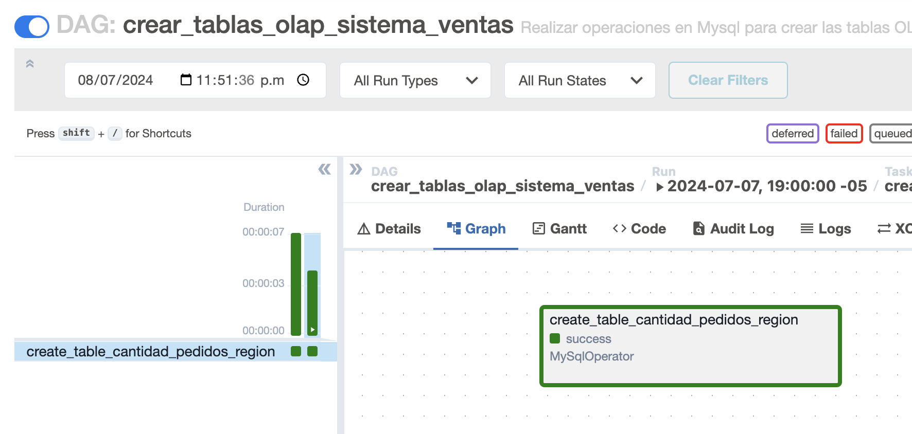
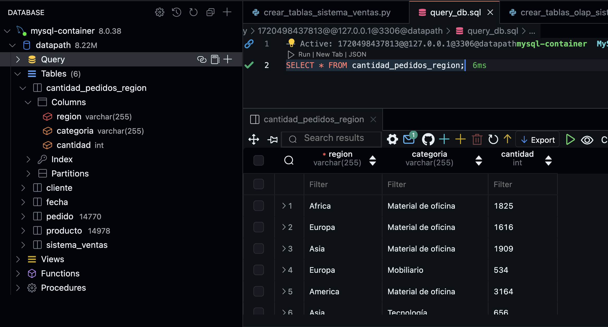

#### Real time processing

##### Requisitos Previos:

1) Crear imagen customizada de Apache Spark

```
@bryanalonso1993 ➜ /workspaces/real_time_processing (main) $ ls
Readme.md  docker-compose.yaml  dumps  register-mysql.json  spark_custom_image
@bryanalonso1993 ➜ /workspaces/real_time_processing (main) $ cd spark_custom_image/
@bryanalonso1993 ➜ /workspaces/real_time_processing/spark_custom_image (main) $ ls
Dockerfile  start-spark.sh
@bryanalonso1993 ➜ /workspaces/real_time_processing/spark_custom_image (main) $ docker build -t apache-spark:v1 .
[+] Building 162.3s (13/13) FINISHED                                                                                                                                     docker:default
 => [internal] load build definition from Dockerfile                                                                                                                               0.2s
 => => transferring dockerfile: 1.44kB                                                                                                                                             0.0s
 => [internal] load metadata for docker.io/library/openjdk:11.0.11-jre-slim-buster                                                                                                 0.7s
 => [auth] library/openjdk:pull token for registry-1.docker.io                                                                                                                     0.0s
```
2) Crear la imagen de apache airflow

```
@bryanalonso1993 ➜ /workspaces/real_time_processing (main) $ cd airflow_custom_image/
@bryanalonso1993 ➜ /workspaces/real_time_processing/airflow_custom_image (main) $ ls
Dockerfile  requirements.txt start.sh
@bryanalonso1993 ➜ /workspaces/real_time_processing/airflow_custom_image (main) $ docker build -t apache-airflow:v1 .
[+] Building 0.7s (12/12) FINISHED                                                                                   docker:default
                                                                       0.0s
```

3) Desplegar la aplicación con docker compose.

```
@bryanalonso1993 ➜ /workspaces/real_time_processing (main) $ docker compose up -d
WARN[0000] /workspaces/real_time_processing/docker-compose.yaml: `version` is obsolete 
[+] Running 88/6
 ✔ jupyter Pulled                                                                                                             86.5s 
 ✔ mysql Pulled                                                                                                               54.2s 
 ✔ zookeeper Pulled                                                                                                           63.9s 
 ✔ kafka Pulled                                                                                                               64.0s 
 ✔ akhq Pulled                                                                                                                63.7s 
 ✔ debezium Pulled                                                                                                            74.6s 
[+] Running 9/9
 ✔ Container spark-master        Started                                                                                       4.3s 
 ✔ Container jupyter-notebook    Started                                                                                       4.3s 
 ✔ Container airflow-standalone  Started                                                                                       4.3s 
 ✔ Container mysql-container     Started                                                                                       4.1s 
 ✔ Container zookeeper           Started                                                                                       4.1s 
 ✔ Container kafka               Started                                                                                       4.5s 
 ✔ Container spark-worker        Started                                                                                       4.8s 
 ✔ Container debezium            Started                                                                                       5.5s 
 ✔ Container ui-kafka            Started  
```

4) En el contenedor de airflow creamos un usuario con el rol Admin.

```
@bryanalonso1993 ➜ /workspaces/real_time_processing (main) $ docker exec -it airflow-standalone bash
airflow@477716bfad36:/opt/airflow$ 
airflow@477716bfad36:/opt/airflow$ 
airflow@477716bfad36:/opt/airflow$ airflow users create --username bryan --firstname Bryan --lastname Almeyda --email balmeyda@uni.pe --role Admin --password claro123
/home/airflow/.local/lib/python3.11/site-packages/flask_limiter/extension.py:333 UserWarning: Using the in-memory storage for tracking rate limits as no storage was explicitly specified. This is not recommended for production use. See: https://flask-limiter.readthedocs.io#configuring-a-storage-backend for documentation about configuring the storage backend.
[2024-07-06T12:34:20.495-0500] {override.py:1516} INFO - Added user bryan
User "bryan" created with role "Admin"
airflow@477716bfad36:/opt/airflow$ 
```

5) Crear la conexión desde Airflow a la base de datos.


6) Crear variable que determina la tabla a poblar.


7) Ejecutar el DAG crear_tablas_sistema_ventas en airflow. 


8) Crear el conector de Debezium.

```
@bryanalonso1993 ➜ /workspaces/real_time_processing (main) $ curl -i -X POST -H "Accept:application/json" -H "Content-Type:application/json" http://localhost:8083/connectors/ -d @register-mysql.json
HTTP/1.1 201 Created
Date: Sun, 30 Jun 2024 22:36:49 GMT
Location: http://localhost:8083/connectors/mysql-connector
Content-Type: application/json
Content-Length: 566
Server: Jetty(9.4.52.v20230823)

{"name":"mysql-connector","config":{"connector.class":"io.debezium.connector.mysql.MySqlConnector","tasks.max":"1","database.hostname":"mysql-container","database.port":"3306","database.user":"root","database.password":"Changeme123","database.server.id":"184054","database.server.name":"datapath","database.include.list":"datapath","schema.history.internal.kafka.bootstrap.servers":"kafka:9092","schema.history.internal.kafka.topic":"schema-changes.datapath","include.schema.changes":"true","topic.prefix":"oltp","name":"mysql-connector"},"tasks":[],"type":"source"}
```
 
##### Prueba Funcional:

9) Ejecutar DAG pobla la base de datos OLTP.

* Pedido


* Producto


10) Validar UI Kafka.


11) Ejecutar DAG que crea la tabla OLAP.



12) Procesamiento en Spark.

```
    root@468d1e8acbe0:/opt/spark# ./bin/spark-submit --packages org.apache.spark:spark-sql-kafka-0-10_2.12:3.5.1 --jars /opt/spark-data/mysql-connector-j-8.4.0.jar  /opt/spark-apps/process_data_pedido.py
24/07/08 23:46:47 INFO TaskSchedulerImpl: Removed TaskSet 2.0, whose tasks have all completed, from pool 
24/07/08 23:46:47 INFO DAGScheduler: ResultStage 2 (showString at <unknown>:0) finished in 0.179 s
24/07/08 23:46:47 INFO DAGScheduler: Job 1 is finished. Cancelling potential speculative or zombie tasks for this job
24/07/08 23:46:47 INFO TaskSchedulerImpl: Killing all running tasks in stage 2: Stage finished
24/07/08 23:46:47 INFO DAGScheduler: Job 1 finished: showString at <unknown>:0, took 0.216191 s
24/07/08 23:46:47 INFO CodeGenerator: Code generated in 7.824468 ms
+-------+-------------------+--------+
| region|          categoria|cantidad|
+-------+-------------------+--------+
| Africa|Material de oficina|    1825|
| Europa|Material de oficina|    1616|
|   Asia|Material de oficina|    1909|
| Europa|         Mobiliario|     534|
|America|Material de oficina|    3164|
|   Asia|         Tecnología|     656|
| Africa|         Mobiliario|     569|
| Europa|         Tecnología|     550|
|Oceanía|         Mobiliario|     152|
|Oceanía|         Tecnología|     127|
|   Asia|         Mobiliario|     632|
|America|         Tecnología|    1053|
|America|         Mobiliario|     995|
| Africa|         Tecnología|     563|
|Oceanía|Material de oficina|     407|
+-------+-------------------+--------+

None
24/07/08 23:46:47 INFO BlockManagerInfo: Removed broadcast_0_piece0 on 468d1e8acbe0:37369 in memory (size: 26.7 KiB, free: 434.4 MiB)
24/07/08 23:46:48 INFO AdminClientConfig: AdminClientConfig values: 
        auto.include.jmx.reporter = true
        bootstrap.servers = [kafka:9092]
        client.dns.lookup = use_all_dns_ips
        client.id = 
        connections.max.idle.ms = 300000
        default.api.timeout.ms = 60000
        metadata.max.age.ms = 300000
        metric.reporters = []
        metrics.num.samples = 2
        metrics.recording.level = INFO
        metrics.sample.window.ms = 30000
        receive.buffer.bytes = 65536
        reconnect.backoff.max.ms = 1000
        reconnect.backoff.ms = 50
        request.timeout.ms = 30000
        retries = 2147483647
        retry.backoff.ms = 100
        sasl.client.callback.handler.class = null
        sasl.jaas.config = null
        sasl.kerberos.kinit.cmd = /usr/bin/kinit
        sasl.kerberos.min.time.before.relogin = 60000
        sasl.kerberos.service.name = null
        sasl.kerberos.ticket.renew.jitter = 0.05
        sasl.kerberos.ticket.renew.window.factor = 0.8
        sasl.login.callback.handler.class = null
        sasl.login.class = null
        sasl.login.connect.timeout.ms = null
        sasl.login.read.timeout.ms = null
        sasl.login.refresh.buffer.seconds = 300
        sasl.login.refresh.min.period.seconds = 60
        sasl.login.refresh.window.factor = 0.8
        sasl.login.refresh.window.jitter = 0.05
        sasl.login.retry.backoff.max.ms = 10000
        sasl.login.retry.backoff.ms = 100
```
13) Validar la tabla cantidad_pedidos_region.



